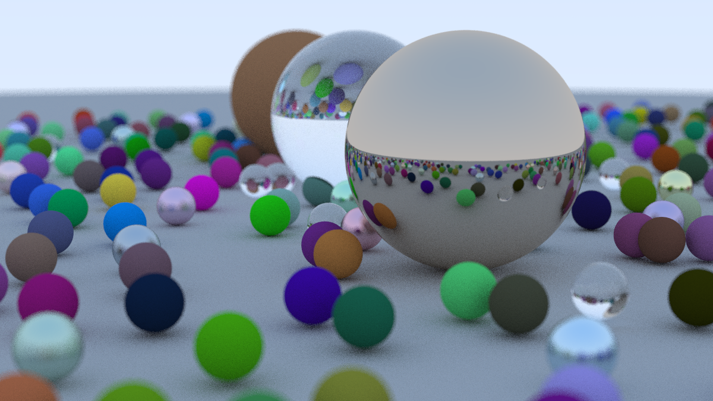

# Ray Tracing

This is just a personal project for funsies.

> I've recently been into computer graphics. I saw [this project](https://github.com/ebkalderon/ray-tracing-in-one-weekend) by [ebkalderon](https://github.com/ebkalderon), so I decided to take a shot at [ray tracing in one weekend](https://raytracing.github.io/books/RayTracingInOneWeekend.html). I'm most likely not going to finish this in one weekend, but it's whatever (a learning experience).

I've finished RTIOW in two weekends (and the school days in between).



### Running Examples
You can specify `<example-name>` with any example defined in `Cargo.toml`. If you want to see rendering progress, prefix the following with `RUST_LOG=info`.
```
  cargo run --example <example-name>
```
You can open PPM files on MacOS with `magick output.ppm display:`.

#### Things to Say
Initially, I wrote my `Vector` struct as generic as possible, employing a `Numeric` trait and supporting `N`-`Vector`s. Moreover, I couldn't even implement `Copy`, so simple arithmetic operations almost always ended up being horrible to write. I learned my lesson after like 5 chapters, when I was looking at other implementations of RTIOW in Rust: I was never going to need `Vector<10, f64>` or even `Vector<3, f32>`! Even doing this for completeness was stupid.

Even worse, I spent practically an entire day debugging and it all came down to initializing a vector with `entries: Box::new([random(); 3])`. `random()` got called once and I actually needed to use `std::array::from_fn()`.

It wasn't after scrolling through [another project](https://github.com/Dalamar42/rayt) (which finished the 3rd book) until I ended `Vector<T, N>`. 

## Part II: The Next Weekend

> Well, technically it's the weekend after...

I might get working on this soon.
